# Health Shield - Your Smart Doctor
---
Project: Health Shield - Your Smart Doctor

Author: CHOU CHIA-HSUAN, Shih Hsin Yi

Date: 2025-12-17

Course: Cloud Computing and Big Data Analytics

---

## 1. Web Application (Streamlit & FastAPI & Cloud Run)

### Functions

1. Provides an interactive interface for inputting parameters, including basic personal information, body measurements, family history, lifestyle habits, blood pressure records, and blood test data.
2. Performs diabetes risk probability prediction.
3. Visualizes model explanations through global and individual SHAP plots

### First Page: Parameter Input

Users can input health-related parameters through an interactive form.

1. If a variable value is unavailable, users may select **“I don’t know”**.

2. If a variable value is out of bounds, the system will display a warning message.
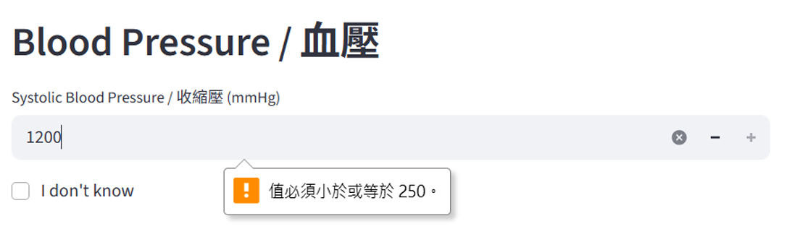
3. If required inputs are left empty, the system will display a warning message before prediction.
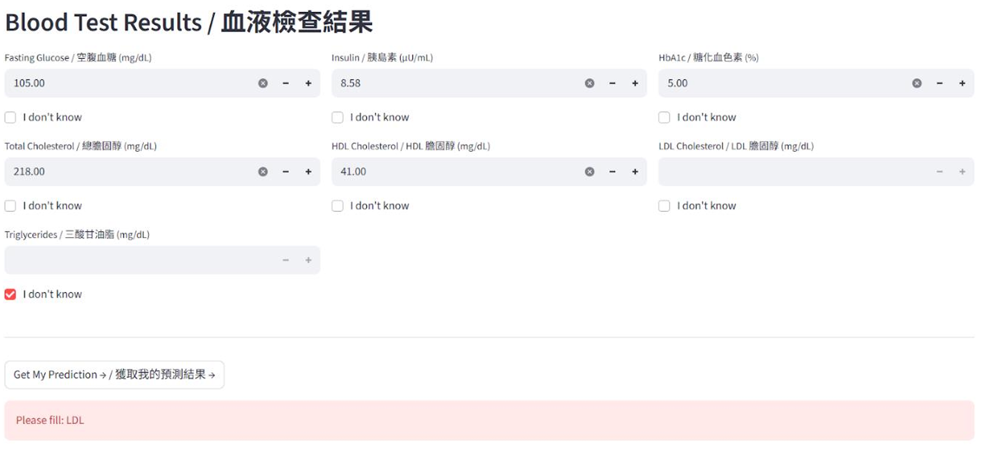

After completing the inputs, click **“View my prediction”** to proceed to the results page.

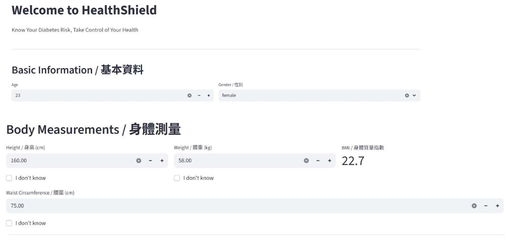
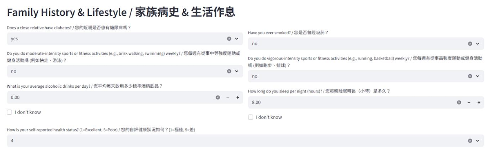
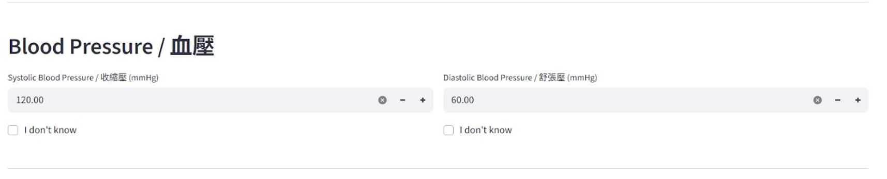
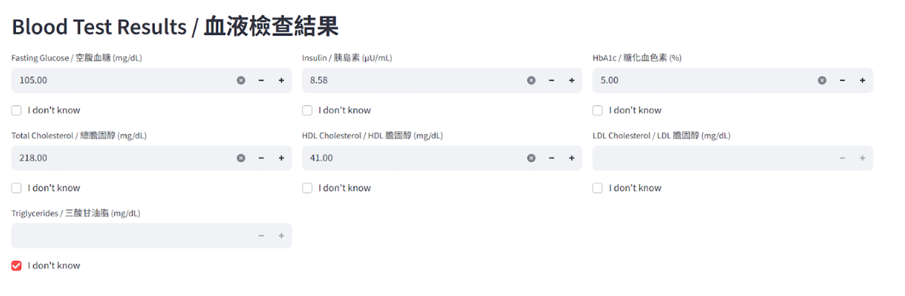

### Second Page: Prediction Results & Model Explainability

#### 1. Diabetes Risk Probability Overview
The system displays the **predicted diabetes risk probability** along with a clear risk level indicator (e.g., **HIGH RISK**). 

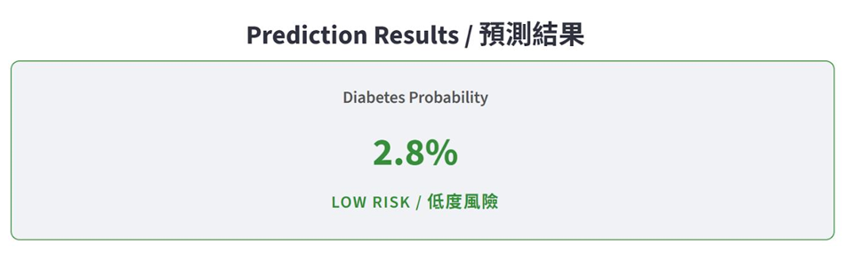

#### 2. Individual Explanation (Local SHAP)
**2-1 Waterfall plot**
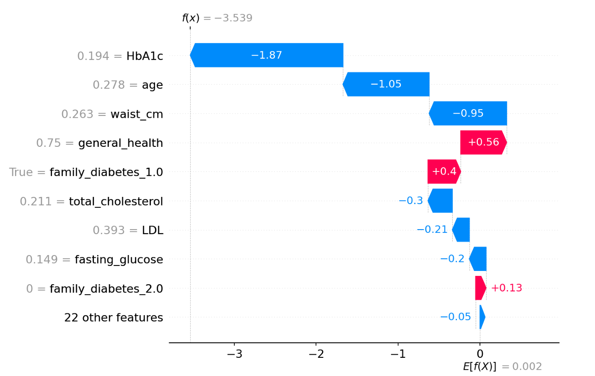

**2-2 Force plot**
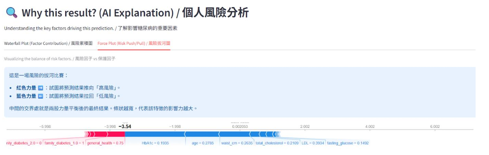

#### 3. Global Explanation (Global SHAP)
**3-1 Beeswarm**
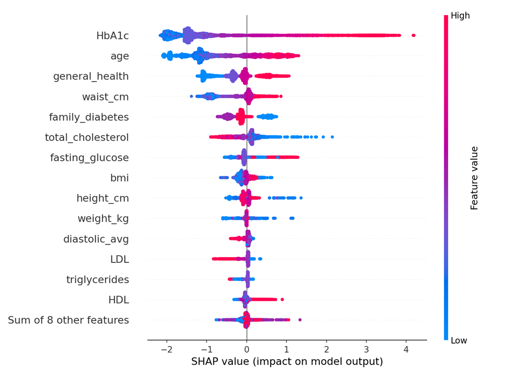

**3-2 Feature Importance Bar plot**
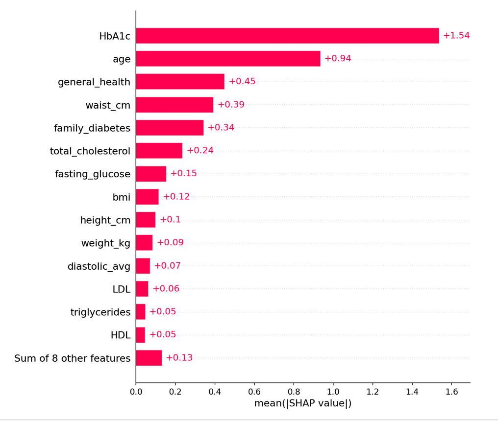

## 2. Contributors

|Teamates | Department          |Contribution |
|---------|---------|----------------------------------|
 **Chou Chia Hsuan(ME)** | **NYCU STATS**  |**Crawl Data, Data collection and preprocessing;logistic regression and SVM models; user input interface; final project summary (Sections 1, 3, 6, and 7); presentation slides (Sections 1–3).**|
|Shih Hsin Yi | NTHU STATS    |Data collection and preprocessing; random forest and XGBoost models; prediction result page; set on cloud platform; final project summary (Sections 2, 4, 5, and 7); presentation slides (Sections 3–5).|

## 3. Code Structure (Cloud Deployment)

### Cloud Run Deployment Files

<pre> 
Diabetes_Project/
├── backend/
│   ├── nhanes_full_pipeline.pkl      # Trained XGBoost pipeline (model + preprocessing)
│   ├── requirements.txt              # Backend dependencies
│   ├── main.py                       # FastAPI backend (inference + SHAP generation)
│   └── Dockerfile                    # Backend container build 
├── frontend/
│   ├── requirements.txt              # Frontend dependencies
│   ├── app.py                        # Streamlit UI (input + visualization)
│   └── Dockerfile                    # Frontend container build 
└── docker-compose.yml                # multi-container setup (frontend + backend)

</pre>        

### Frontend & Backend (Separated Containers)

<pre> 
Frontend (Streamlit)
--------------------------------------------------
1. Provides the web UI for users to input health-related features (Page 1).
2. Sends processed inputs to the backend /predict API for inference.
3. Displays prediction results, including:
   - Risk probability and risk level
   - Individual SHAP plots (waterfall plot, force plot)
   - Global SHAP plots (beeswarm plot, feature importance bar plot)

        |                           ^
        |   JSON inputs             |   Predictions & SHAP plots
        v                           |
--------------------------------------------------
Backend (FastAPI)
--------------------------------------------------
1. Loads the trained pipeline from nhanes_full_pipeline.pkl.
2. Performs model inference to calculate diabetes risk probability.
3. Generates SHAP-based explanations (local and global).
</pre> 

### Deployment

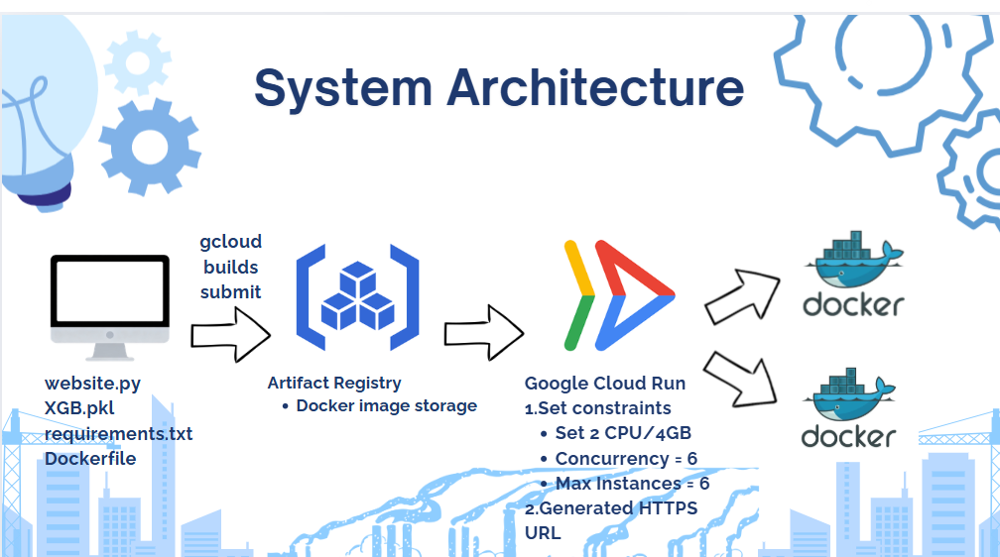

The system is deployed using **Docker** and **Google Cloud Run** with a frontend–backend separated architecture to ensure a consistent execution environment and scalable access.

The deployment process includes:
1. Containerizing the frontend (Streamlit) and backend (FastAPI + XGBoost model) as separate Docker images.
2. Pushing both Docker images to Google Artifact Registry.
3. Deploying each image as an independent Cloud Run service with predefined CPU, memory, and concurrency settings.
4. Configuring the frontend service to communicate with the backend service via HTTPS RESTful APIs.
5. Automatically generating HTTPS endpoints for both services through Google Cloud Run.

### Local
<pre> 
├── crawl.py       # Crawl NHANES XPT files from official sources
├── combine_xpt.py  # Convert and merge NHANES XPT files into CSV format (biannual)
├── combine_year.py # Combine multiple biannual CSV files into a single dataset
├── ALL_NHANES_MERGED_20072018.csv        # Merged NHANES dataset (2007–2018)
├── 1213_NHANES_20072020_ensemble.ipynb     # Model training and evaluation notebook
├── README.md        
</pre>  

## 4. Dataset

**NHANES 2007~2018 dataset**

- **Target variable**: diabetes (1: Diagnosed with diabetes, 0: No diabetes) 
- **Class imbalance**: Diabetes cases are relatively rare  
  - Non-diabetes: **91.66%**  
  - Diabetes: **8.34%**

###  Features
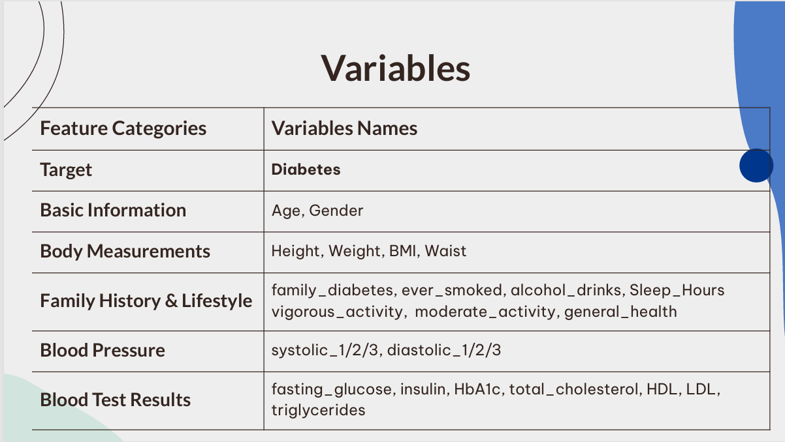

###  Data Preprocessing
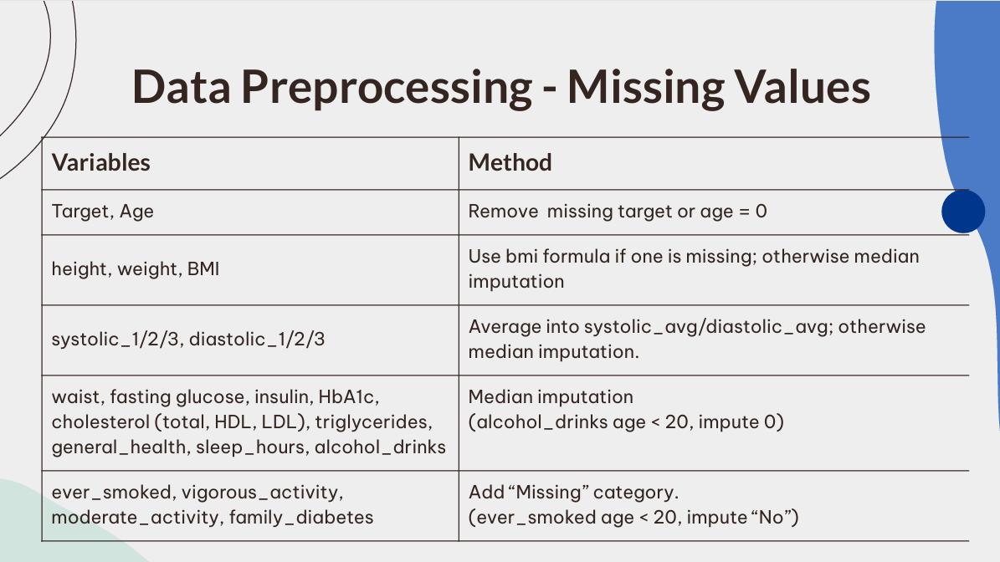
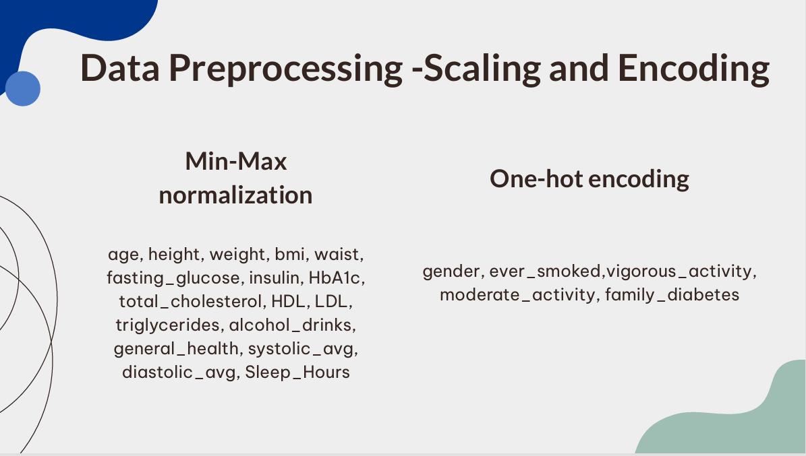

## 5. Model Experiments & Selection

### Data Split
- Train:Test = 8:2  
- Stratified split

### Model Comparison

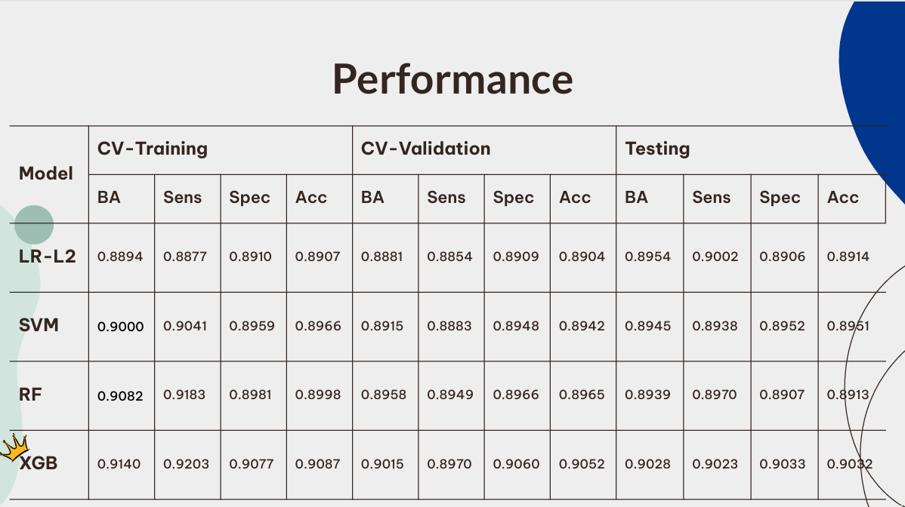

